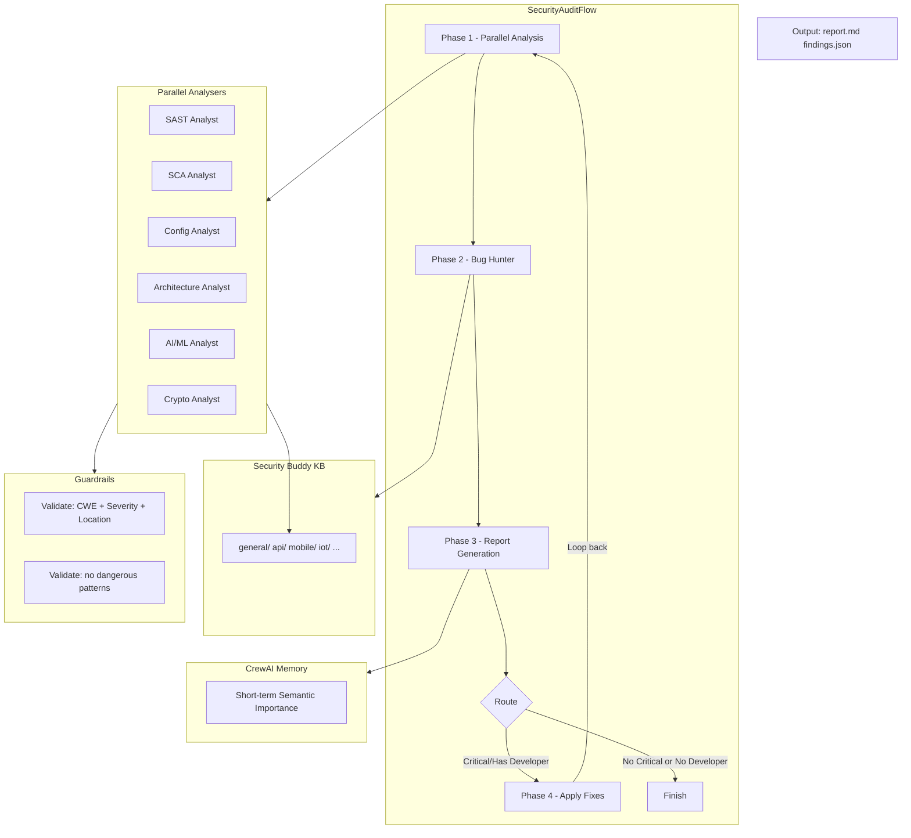

# Security Buddy — CrewAI Security Audit Crew

A containerized CrewAI agent team that analyzes your project for security maturity, generates a comprehensive AppSec report, and optionally fixes issues iteratively. Built on CrewAI **Flow** for conditional branching, **Memory** for cross-iteration context, **Guardrails** for output validation, and **async execution** for parallel analysis.

## Architecture



## Features

### Network Security & Privacy Controls

Your code and report data stay under your control. The crew supports three privacy layers:

```yaml
network:
  internet_access: false    # OFFLINE mode -- only LLM API calls exit the container
  privacy_mode: true        # anonymise project paths in reports & logs
  allowed_domains: []       # restrict outbound to specific domains only
  data_egress_control: true # log every outbound request for audit
```

- **`internet_access: false` (default)**: The container runs fully offline. Project source code, report data, and findings never leave the container. The only outbound call is the configured LLM API. All other network access is blocked at the kernel level.
- **`privacy_mode: true`**: Before saving any report or log, all absolute paths (`/project`, `/knowledge`) are replaced with placeholders (`[PROJECT_ROOT]`, `[KNOWLEDGE_BASE]`). This prevents sensitive directory structures from leaking into the report.
- **`allowed_domains`**: If you *do* enable internet access, restrict outbound to specific API endpoints (e.g., `["api.openai.com", "api.anthropic.com"]`). Everything else is blocked.
- **`data_egress_control`**: Every outbound request is logged to `network_access_log.json` for your audit trail.

> TIP: For maximum privacy: keep `internet_access: false` and `privacy_mode: true`. Only LLM API calls leave the container, and no path information is present in the output report.

### Multi-Format Reporting

Generate reports in multiple standards simultaneously:

```yaml
reporting:
  language: en              # en | ru -- report language
  formats:
    - owasp                 # default OWASP-style markdown
    # - gost_r_56545        # GOST R 56545-2015 Vulnerability Passport
    # - gost_r_56939        # GOST R 56939-2016 Secure Development
    # - nist_sar            # NIST SP 800-53 SAR with POA&M
    # - iso_27001           # ISO/IEC 27001 Annex A.14 mapping
  include_attack_chain: true
  include_business_impact: true
```

Each format instructs the LLM to structure findings according to the respective standard's requirements. You can enable multiple formats at once -- the report will include sections for each.

Run in Russian:
```bash
REPORT_LANGUAGE=ru INTERNET_ACCESS=false docker compose up --build
```

### Progress Display

When running, the terminal shows a live progress bar with:

```
  [=====================----------]  35.2%  ETA 0:04:23  | [ANALYZE] Parallel Analysis [2/6]  SAST Analyst: scanning...
```

- Progress bar with weighted phases (analysis is weighted heavier than init/output)
- ETA estimated from elapsed time vs completed work weight
- Current phase name and step count: `[ANALYZE] Parallel Analysis [2/6]`
- Active step description, e.g. which agent is currently running

Progress is driven by CrewAI's built-in callbacks (`step_callback`, `task_callback`) plus manual phase transitions.

### Pydantic Structured Output Enforcement

All LLM outputs are enforced to match Pydantic models via deterministic retry recall. This guarantees that every finding, exploit chain, and report has consistent typed fields -- no free-form text or malformed output.

How it works:
1. Each task's prompt instructs the LLM to output ONLY valid JSON matching the Pydantic schema.
2. After generation, `enforce_structured_output()` attempts to parse the raw text.
3. If parsing fails (JSONDecodeError or ValidationError), the LLM is re-prompted up to 5 times with the schema definition, asking it to reformat.
4. The fallback is an empty/default Pydantic instance -- never None.

```python
# crew.py -- enforce_structured_output core logic
def enforce_structured_output(raw_text, model_class, max_recall=5, llm=None):
    for attempt in range(max_recall):
        json_str = _extract_json(raw_text)
        if json_str:
            try:
                parsed = json.loads(json_str)
                return model_class.model_validate(parsed)
            except (JSONDecodeError, ValidationError):
                pass
        if llm:
            raw_text = llm.generate(f"Return ONLY valid JSON matching schema...")
    return model_class()  # fallback default
```

This is applied as a guardrail on every analysis task:
```python
guardrail=lambda o: validate_structured_finding(o, llm),
guardrail_max_retries=5,
```

The enforced models are defined in `models.py` and include: `Finding`, `ExploitChain`, `FixResult`, `AuditReport`, `SBOM`.

## Quick Start

### 1. Prerequisites

- Docker and Docker Compose
- An API key for your preferred LLM provider (OpenAI, Anthropic, Google, or local Ollama)

### 2. Configuration

1. Copy the example config:
   ```bash
   cp config.example.yaml config.yaml
   ```

2. Edit `config.yaml`:
   ```yaml
   llm:
     provider: openai        # openai | anthropic | google | ollama | custom
     model: gpt-4o           # model name
     api_key: sk-...         # your API key
     api_base: ~             # optional: for custom/ollama endpoints
     temperature: 0.1        # lower = more deterministic
     role_overrides:
       developer:
         model: gpt-4o-mini  # cheaper model for code generation
       bug_hunter:
         model: gpt-4o       # more capable for exploit chain analysis
         temperature: 0.3

   crew:
     max_iterations: 5       # max analysis-report-fix cycles
     planning_enabled: true  # AgentPlanner creates task plans
     use_memory: true        # cross-iteration memory

   agents:
     include_developer: false  # set true to add developer agent
     include_bug_hunter: true   # bug hunter for exploit chains
     human_input_for_critical: true  # human approval for critical fixes
   ```

### 3. Run

```bash
# Build and run
docker compose up --build

# Or just run once
docker compose run --rm security-audit
```

### 4. Output

After execution, the crew produces:

| File | Description |
|------|-------------|
| `output/report.md` | Full AppSec maturity report |
| `output/findings.json` | Machine-readable findings (structured JSON) |
| `output/developer_prompts.md` | Generated prompts for developer agent |
| `output/logs/audit.json` | Structured execution log (if enabled) |

## Flow Phases

### Phase 1: Parallel Analysis (`@start`)
Six analysts run simultaneously via `async_execution=True`:
- **SAST Analyst** — source code vulnerabilities
- **SCA Analyst** — dependency CVEs and supply chain
- **Config Analyst** — Docker/K8s/CI/CD misconfigurations
- **Architecture Analyst** — design flaws, STRIDE
- **AI/ML Analyst** — OWASP LLM Top 10 (conditional activation)
- **Crypto Analyst** — cryptographic weaknesses

Each task has a **guardrail** ensuring output contains CWE, severity, and location. Tasks retry up to 3 times on guardrail failure.

### Phase 2: Bug Hunter (`@listen`)
The **Bug Hunter** agent reviews combined findings from all analysts and identifies **exploit chains** — sequences of low/medium issues that combine into critical attack paths (e.g., XSS + missing CSP + stored sensitive data → session hijacking).

### Phase 3: Report Generation (`@listen`)
The **Reporter** compiles all findings + exploit chains into a comprehensive AppSec report with executive summary, business impact, and remediation roadmap.

### Phase 4: Conditional Fix (`@router`)
The **Flow router** decides:
- **→ "fix"** — if critical findings exist AND developer agent is enabled AND iteration limit not reached AND changes were made previously
- **→ "finish"** — otherwise (no critical findings, no developer, max iterations, or 2 consecutive no-change iterations)

The developer agent applies fixes with a **fix guardrail** that checks for dangerous patterns (`chmod 777`, `eval()`). Critical findings require **human approval** before automatic fixing.

## Agent Roles

### Analyser Agents (run in parallel)

| Agent | Responsibility | Guardrail |
|-------|---------------|-----------|
| **SAST Analyst** | Scans source code for vulnerabilities | CWE + Severity + Location |
| **SCA Analyst** | Checks dependencies for known CVEs | CVE + Severity + CVSS |
| **Config Analyst** | Reviews Docker, K8s, CI/CD configs | Severity + File + Remediation |
| **Architecture Analyst** | Reviews design, data flows, trust boundaries | STRIDE + Component + Attack |
| **AI/ML Analyst** | Reviews LLM/ML code if present | LLM01-10 + Severity |
| **Crypto Analyst** | Reviews crypto implementations | CWE + Severity + Replacement |

### Bug Hunter

| Responsibility | Input | Output |
|---------------|-------|--------|
| Finds exploitable chains from combined findings | All analyst outputs | Chain ID + Attack path + Impact + Chain-breaking fix |

### Reporter Agent

| Responsibility |
|---------------|
| Compiles all findings + exploit chains into structured report |
| Translates technical risks into business impact |
| Generates developer prompts for fix agent |

### Developer Agent (optional)

| Feature | Detail |
|---------|--------|
| Enabled by | `agents.include_developer: true` |
| Code execution | `allow_code_execution=True`, `code_execution_mode="safe"` |
| Guardrail | Validates fixes don't use dangerous patterns |
| Human input | `human_input=True` for critical findings |
| Early exit | Stops after 2 iterations with no changes |

## Guardrails

### Finding Validation
```python
def validate_finding_has_cwe_and_severity(output: str) -> bool:
    """Ensures every finding has CWE/CVE, Severity, and Location."""
    checks = [
        ("CWE-" in output or "CVE-" in output),
        any(s in output for s in ["Critical", "High", "Medium", "Low"]),
        "Location:" in output or "file:" in output,
    ]
    return all(checks)
```

### Fix Validation
```python
def validate_fix_does_not_break(output: str) -> bool:
    """Blocks dangerous code patterns in automated fixes."""
    danger_signals = ["rm -rf /", "chmod 777", "eval(", "exec(",
                      "pickle.loads", "dangerouslySetInnerHTML"]
    return not any(s in output.lower() for s in danger_signals)
```

## Memory Configuration

CrewAI Memory with three weighted components:

```yaml
crew:
  use_memory: true
```

```python
Memory(
    recency_weight=0.4,     # recent interactions matter most
    semantic_weight=0.4,    # semantic similarity
    importance_weight=0.2,   # how important was the info
)
```

This is critical for the developer agent — it remembers which fixes were already applied in previous iterations.

## Structured Output (Pydantic)

```python
class Finding(BaseModel):
    id: str
    severity: str           # Critical/High/Medium/Low
    cwe: str | None         # e.g. CWE-79
    location: str           # file:line or component
    description: str
    technical_impact: str
    business_impact: str
    remediation: str

class ExploitChain(BaseModel):
    chain_id: str           # CHAIN-001
    severity: str
    attack_path: list[str]  # step-by-step
    technical_impact: str
    business_impact: str
    chain_breaking_fix: str

class FixResult(BaseModel):
    finding_id: str
    applied: bool
    diff: str | None        # before/after patch
```

## Agent Safety Limits

Each agent has configurable safety limits:

```yaml
# In agents.yaml
bug_hunter:
  max_iter: 15             # max reasoning steps
  max_execution_time: 600  # seconds (10 minutes)
  max_retry_limit: 3       # guardrail retries

developer:
  max_iter: 10
  max_execution_time: 300  # 5 minutes
  max_retry_limit: 3
  allow_code_execution: true
  code_execution_mode: safe  # Docker-isolated
```

## Observable Callbacks

```python
def log_step(agent, action, result):
    """Log every agent action for debugging."""
    logging.info(f"[{agent.role}] {action.tool} → {str(result)[:100]}")

crew = Crew(
    ...,
    step_callback=log_step,
    task_callback=lambda t: logging.info(f"[TASK] {t.agent} done"),
    output_log_file="logs/audit.json",
)
```

## Iteration Control

### Flow-based Early Termination

The Flow router automatically stops when:
- `max_iterations` reached
- No critical/high findings remain
- Developer agent makes no changes for **2 consecutive iterations**

### Cost Control

| Parameter | Effect |
|-----------|--------|
| `llm.temperature: 0.1` | Lower temperature = fewer tokens, more deterministic |
| `crew.max_iterations: 3` | Limit cycles for quick scans |
| `include_developer: false` | Skip fixing — analysis only, lower cost |
| `include_bug_hunter: false` | Skip exploit chain analysis |
| Per-role LLM overrides | Use cheaper models (gpt-4o-mini) for developer |

## Using Different LLM Providers

### OpenAI
```yaml
llm:
  provider: openai
  model: gpt-4o
  api_key: ${OPENAI_API_KEY}
```

### Anthropic Claude
```yaml
llm:
  provider: anthropic
  model: claude-sonnet-4-20250514
  api_key: ${ANTHROPIC_API_KEY}
```

### Google Gemini
```yaml
llm:
  provider: google
  model: gemini-2.0-flash
  api_key: ${GOOGLE_API_KEY}
```

### Local Ollama
```yaml
llm:
  provider: ollama
  model: llama3.3:70b
  api_key: ~
  api_base: http://host.docker.internal:11434
```

### Per-role LLM Configuration
```yaml
llm:
  provider: openai
  model: gpt-4o
  role_overrides:
    developer:
      model: gpt-4o-mini      # cheaper for code generation
      temperature: 0.2
    bug_hunter:
      model: gpt-4o           # more capable for chain analysis
      temperature: 0.3
```

## Environment Variables

| Variable | Description | Default |
|----------|-------------|---------|
| `LLM_PROVIDER` | LLM provider name | `openai` |
| `LLM_MODEL` | Model name | `gpt-4o` |
| `LLM_API_KEY` | API key | — |
| `LLM_API_BASE` | Custom API endpoint | — |
| `MAX_ITERATIONS` | Max analysis-fix cycles | `5` |
| `INCLUDE_DEVELOPER` | Enable developer agent | `false` |
| `PROJECT_PATH` | Path to user project | `/project` |
| `KNOWLEDGE_PATH` | Path to security-buddy | `/knowledge` |
| `VERBOSE` | Detailed logging | `true` |

## Examples

### Quick security scan (no fixes, no bug hunter, 3 iterations)
```bash
INCLUDE_DEVELOPER=false MAX_ITERATIONS=3 docker compose up --build
```

### Full audit with bug hunter (analysis only, no fixes)
```bash
INCLUDE_DEVELOPER=false INCLUDE_BUG_HUNTER=true docker compose up --build
```

### Full audit with fixes (10 iterations, Claude, bug hunter enabled)
```bash
LLM_PROVIDER=anthropic LLM_MODEL=claude-sonnet-4-20250514 \
  LLM_API_KEY=$ANTHROPIC_API_KEY \
  INCLUDE_DEVELOPER=true MAX_ITERATIONS=10 \
  docker compose up --build
```

### Local LLM (Ollama)
```bash
LLM_PROVIDER=ollama LLM_MODEL=llama3.3:70b \
  LLM_API_BASE=http://host.docker.internal:11434 \
  docker compose up --build